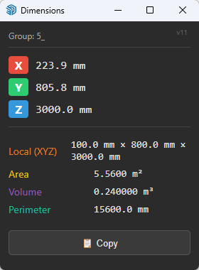

# 📐 Dimensions Viewer (EN/RU versions)

A SketchUp extension that displays the **dimensions, area, volume, and perimeter**
of selected objects in real time.

## Features
- Bounding box dimensions along the X / Y / Z axes
- Local dimensions for rotated groups and components
- Surface area (m²)
- Volume (m³)
- Edge perimeter
- One-click copy of all values
- Auto-update on selection change, Undo / Redo

## Installation
1. Download `dimensions_viewer.rbz` from the [Releases](../../releases) section.
2. In SketchUp: **Extensions → Extension Manager → Install Extension**.
3. Select the downloaded `.rbz` file.

## Usage

Open **Extensions → Dimensions Viewer**. Select any object — the window
updates automatically.

## Requirements

- SketchUp 2017 or newer
- Model in millimeters (for correct local dimensions)

## License

[MIT](LICENSE)

